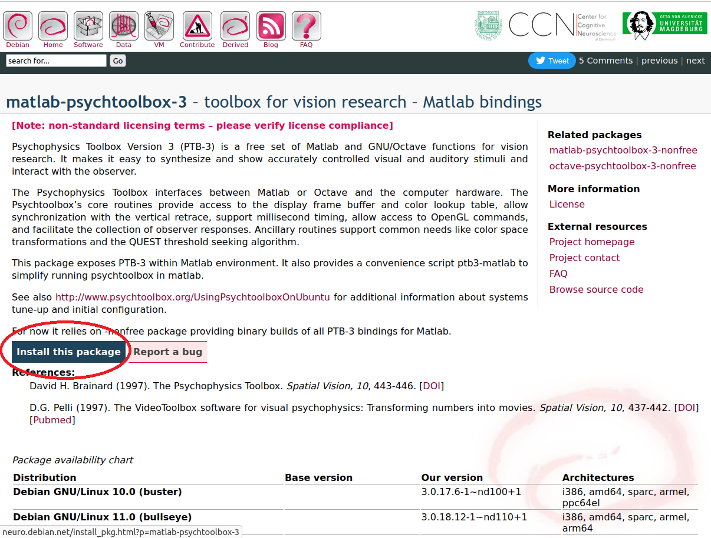
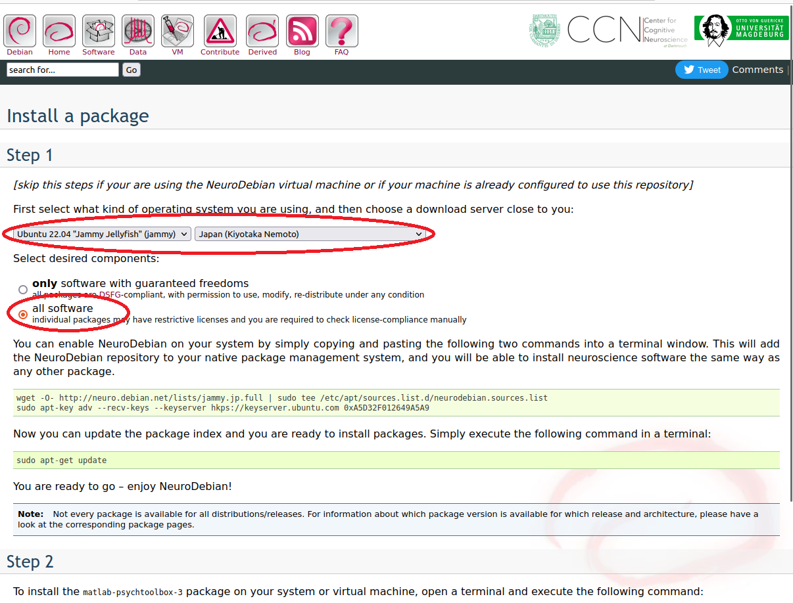
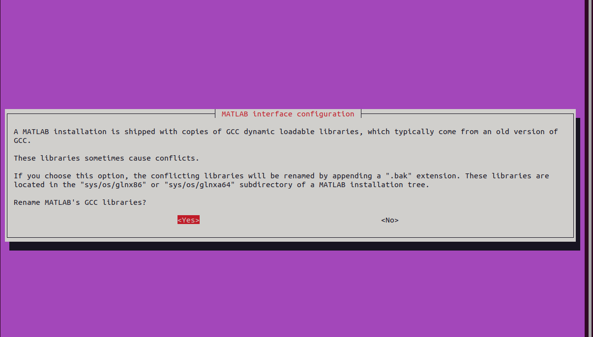

# Psychtoolbox_demo_Japanese

This is an unofficial Japanese tutorial for Psychtoolbox3. 
This project is written in Japanese.
Open in Unicode environment if it looks broken.

---

このプロジェクトは大学研究室内の教育用資料として公開しているものです。  
学生個人による非公式な資料であり、正確な情報はMathWorks社およびPsychtoolboxの公式サイトおよびフォーラムを参照してください。  
以降、Psychtoolbox3をPTBと略称する。

## コンテンツ

- demo_ForBeginner.m：はじめてPTBに触れる人はこれを読むこと。コメントで細かく説明を入れていて、初学者が読むだけで基本を網羅できるようにしている。
- demo_StimTracker.m：Cedrus社のStimTrackerを用いた同期を行うためのデモコード。
- template_Simple.m：簡単な実験プログラムを新規作成する際のひな形。
- template_Tobii.m：Tobiiアイトラッカーを用いた実験プログラムを新規作成する際のひな形。

## PTBのインストール

Ubuntu 22.04 LTSにMATLAB R2022aをインストールしている環境を例に説明する。

基本的にはUbuntu等のDebian系Linuxを選ぶべきである。
Windows10以降のWindowsは正常に動作しているのか判断することが難しく、本当にコンピュータに精通している者以外はWindowsは避けるべきである。

ビギナーは避けるべき環境
- Windows及びMac
- 32bit及びARM系
- ハイブリッドグラフィックスのノートPC

ビギナーに推奨する環境
- AMD製GPUを搭載したデスクトップPC + Ubuntu

まずはじめにPTB公式サイトのダウンロードページを熟読すべきである。  
[http://psychtoolbox.org/download.html](http://psychtoolbox.org/download.html)

### NeuroDebianレポジトリの追加

Ubuntu等のDebian系LinuxではNeuroDebianを利用すると、インストール時に依存関係や不具合を自動的に解消してくれるので便利。  
これがないと全て手動でインストール・修正する必要がある。

PTB3ダウンロードページからNeuroDebianページにいく。

自分のLinuxディストリビューションとバージョン（今回はUbuntu 22.04 LTS）が対応していることを確認し、*Install this package*をクリック。

自分の環境を選択して、現在地から地理的に近いサーバーを選択。*all software*を選択。

選択したら下にコマンドが出てくるのでターミナルを開いて実行する。

`sudo apt update`のあとに最後に以下のコマンドを実行する。  
**重要：選択肢はすべて*YES*を選択すること。**

~~~
sudo apt install matlab-psychtoolbox-3
~~~

PTBをインストールするMATLABのディレクトリを指定（画像はデフォルトとインストール先が違うので注意）。

通常はユーザーは空欄でOK。

これは必ず**YES**を選択すること。

これでNeuroDebianは完了。

MATLABをインストールする前にPTBをインストールした場合はMATLABインストール後にターミナルで以下を実行すること。  
~~~
sudo dpkg-reconfigure matlab-support
~~~

### PTB3のインストール

次に、Psychtoolbox公式ダウンロードページから[**Downloadpsychtoolbox.m**](https://raw.github.com/Psychtoolbox-3/Psychtoolbox-3/master/Psychtoolbox/DownloadPsychtoolbox.m.zip)をダウンロードして解凍する。

MATLABをrootで起動する。(シンボリックリンクがある場合は以下で起動可)

~~~
sudo matlab
~~~

2022年現在、`sudo matlab`で起動するとクラッシュするバグが報告されている。  [https://jp.mathworks.com/matlabcentral/answers/1619660-matlab-2021b-crashed-when-running-with-sudo-root
](https://jp.mathworks.com/matlabcentral/answers/1619660-matlab-2021b-crashed-when-running-with-sudo-root
)

MATLABクラッシュレポーターを触らなければPTBのインストールは可能である。

MATLABを起動したら**Downloadpsychtoolbox.m**のフォルダーに移動して以下を確認する。
- GPUの正しい端子にディスプレイを接続する
- ディスプレイを2枚以上接続しない
- ディスプレイケーブルの変換アダプタを使用しない

確認できたらMATLABのコマンドウィンドウで`DownloadPsychtoolbox('インストール先のディレクトリ')`を実行する。

~~~
#　ダウンロードしたフォルダーに移動（適切なディレクトリを入れる）
cd /home/(ユーザー名)/Downloads

#　MATLABのtoolboxフォルダーのパス（適切なディレクトリを入れる）
DownloadPsychtoolbox('/(適切なパス)/MATLAB/R2022a/toolbox')
~~~

インストールが始まったら、出てくる文章を注意深く読みながら、インストーラーの指示に従う。英語が苦手な人は助っ人を用意しておくと良い。

グループに追加するユーザーを入力する時はrootに加えてローカルユーザーの入力を忘れずに。

無事にインストールが終了したら、MATLABを終了する。PTB公式ページの以下を読んだうえで、

[http://psychtoolbox.org/linux](http://psychtoolbox.org/linux)

ターミナルよりMATLABをコマンドラインモードで起動する。

~~~
matlab -nojvm 
~~~

MATLABで以下のコマンドを一度だけ実行する。

~~~
PsychLinuxConfiguration
~~~

`DownloadPsychtoolbox`の時と同様に表示される文章を読みながら進めていき、グループにユーザーを追加する時だけ忘れなければOK。

### インストールに失敗したら

- エラーメッセージを真面目に読む
- エラーメッセージで指摘されている問題を解決する

問題を解決したら、sudo権限でMATLABを起動して、以下のようにPTBのディレクトリに移動して`SetupPsychtoolbox`を実行する。

~~~
cd([matlabroot '/toolbox/Psychtoolbox'])
SetupPsychtoolbox
~~~

### インストール完了後

これでインストールは完了したのでPsychDemoを動かしてみよう。  
念のために一度PCを再起動して、MATLABを起動する。  
MATLABで以下のコマンドを実行してみて、動作したらインストール成功！

~~~
# はじめて動かすと楽しいデモ
LinesDemo
DrawFormattedTextDemo
KbDemo
SadowskiDemo
~~~
